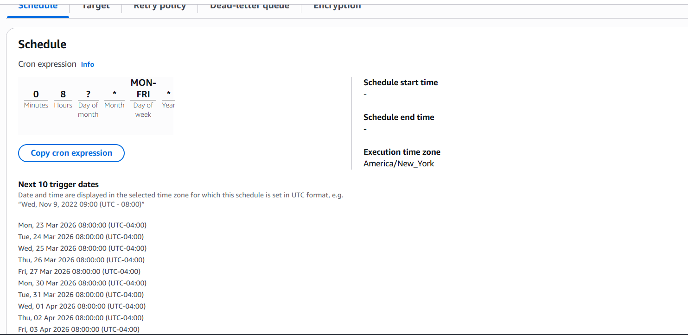
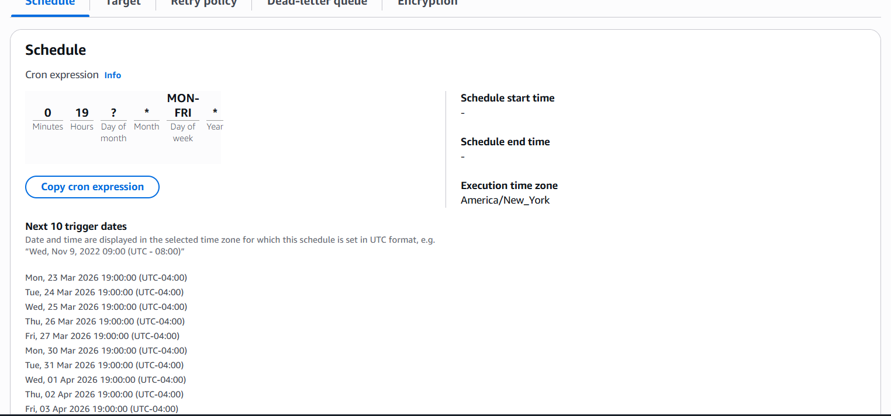
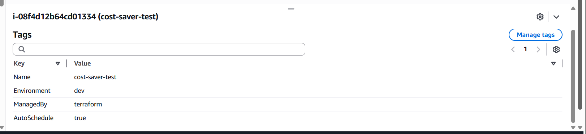
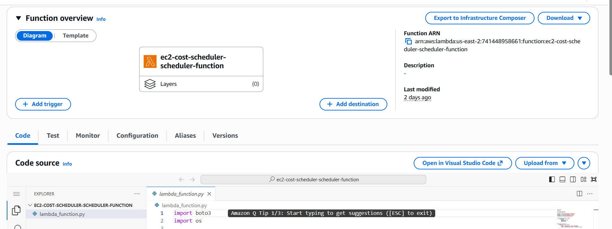
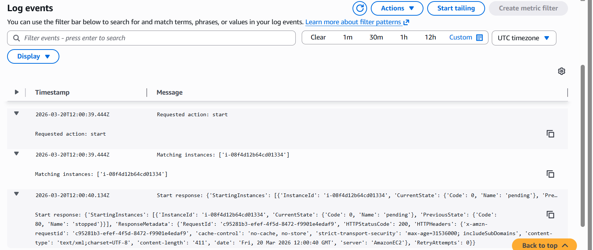

# AWS EC2 Cost Optimization Scheduler (Terraform)

## Overview

This project implements a real-world solution for optimizing cloud costs by automatically managing non-production EC2 instances based on business hours.

Using an event-driven architecture and Infrastructure as Code (Terraform), the system dynamically starts and stops tagged EC2 instances on a defined schedule. This approach reduces unnecessary runtime, improves operational efficiency, and demonstrates how organizations can significantly lower cloud expenses through automation.

---

## Business Problem

In many organizations, development and testing environments run 24/7 even though they are only needed during working hours.

Example:
- 20 EC2 instances  
- ~$50/month each  
- = ~$1,000/month wasted  

This solution eliminates that waste by automatically shutting down unused infrastructure.

---

## Architecture Summary

- EventBridge Scheduler triggers actions on a defined schedule  
- Lambda dynamically identifies EC2 instances using tags  
- IAM enforces least-privilege and prevents unauthorized actions  
- CloudWatch Logs captures execution details  
- SNS provides operational notifications  
- Terraform provisions all infrastructure  
- HCP Terraform manages remote state  

---

## 📸 Screenshots

### 🕒 Event Scheduling (EventBridge)
Defines automated start/stop schedules aligned with business hours.

### 🏷️ EC2 Tagging Strategy
Instances are dynamically selected using tags, eliminating hardcoded resource IDs.

### ⚙️ Lambda Execution Logic
Lambda function processes events and executes start/stop actions using Boto3.

### 📊 Observability (CloudWatch Logs)
Execution logs provide visibility into system behavior and troubleshooting.

---

## Repository Structure

ec2-scheduler-project/
├── README.md
├── .gitignore
│
├── docs/
│   └── screenshots/
│       ├── amazon-eventbridge-schedules.png
│       ├── cloudwatch-start.png
│       ├── cloudwatch-stop.png
│       ├── ec2-tags.png
│       ├── eventbridgebusinesshoursstart.png
│       ├── eventbridgebusinesshoursstop.png
│       └── lambda-function.png
│
├── lambda/
│   └── lambda_function.py
│
└── terraform/
    ├── main.tf
    ├── outputs.tf
    ├── providers.tf
    ├── variables.tf
    ├── .terraform.lock.hcl

---

## 🔷 Key Design Decisions

---

### 🔹 Tag-Based Automation
- Eliminates hardcoded resource IDs  
- Enables dynamic discovery of EC2 instances  
- Scales automatically as infrastructure grows  
- Aligns with real-world cloud governance practices  

---

### 🔹 Least-Privilege IAM
- Restricted permissions:
  - `ec2:StartInstances`
  - `ec2:StopInstances`
  - `ec2:DescribeInstances`
- Enforced with condition:
  - `ec2:ResourceTag/AutoSchedule = true`
- Prevents unauthorized actions even if Lambda logic is modified  

---

 ### 🔹 Remote State (HCP Terraform)

 This project uses HCP Terraform to securely manage remote state, aligning with production-grade Infrastructure as Code practices.

- Eliminates local `.tfstate` files from the repository  
- Prevents state file conflicts across multiple users  
- Enables team collaboration with state locking  
- Secures sensitive infrastructure data  
- Ensures consistent and reliable infrastructure deployments  

---

### 🔹 Event-Driven Architecture
- Fully serverless (no persistent compute resources)  
- Cost-efficient and scalable  
- Loosely coupled components  
- Aligns with modern cloud-native design patterns  

---

## How It Works (Step-by-Step)

1. EventBridge Scheduler triggers Lambda on a schedule (start/stop events)  
2. Lambda receives an event payload: { "action": "start" } or { "action": "stop" }  
3. Lambda queries EC2 using tag filters:  
   - AutoSchedule = true  
   - Environment = dev  
4. Lambda builds a list of matching instance IDs  
5. Lambda calls start_instances or stop_instances  
6. Execution results are logged in CloudWatch  
7. SNS sends notification of success or failure  

---

## Deployment Guide (Detailed)

### Prerequisites

- AWS account with appropriate permissions  
- Terraform installed (v1.5+ recommended)  
- AWS CLI configured (aws configure)  
- HCP Terraform account  
- Git installed  

---

### Step 1: Clone the Repository

git clone https://github.com/YOUR_USERNAME/aws-ec2-cost-optimization-scheduler-terraform.git  
cd aws-ec2-cost-optimization-scheduler-terraform/terraform  

---

### Step 2: Configure Variables

Create a terraform.tfvars file:

aws_region        = "us-east-2"  
project_name      = "ec2-cost-scheduler"  
notification_email = "your-email@example.com"  

tag_key_1   = "AutoSchedule"  
tag_value_1 = "true"  

tag_key_2   = "Environment"  
tag_value_2 = "dev"  

---

### Step 3: Authenticate with HCP Terraform

terraform login  

---

### Step 4: Initialize Terraform

terraform init  

---

### Step 5: Review the Plan

terraform plan  

Verify:
- Lambda function creation  
- IAM roles and policies  
- EventBridge schedules  
- SNS topic and subscription  
- EC2 test instance  

---

### Step 6: Apply the Infrastructure

terraform apply  

Type: yes  

---

### Step 7: Confirm SNS Subscription

- Check your email inbox  
- Click the confirmation link from AWS SNS  
- Without this step, notifications will not work  

---

### Step 8: Test the System

Manual Lambda test:

{ "action": "stop" }  

Then:

{ "action": "start" }  

Verify:
- EC2 instance state changes  
- CloudWatch logs are created  
- SNS email is received  

---

### Step 9: Validate IAM Restrictions

Remove the tag:

AutoSchedule = true  

Run Lambda again.

Expected result:
- Instance is NOT stopped  
- Confirms IAM least-privilege enforcement  

---

## Tags Required

AutoSchedule = true  
Environment  = dev  

Only instances with these tags will be managed.

---

## Example Schedule

- Start: 8:00 AM (Mon–Fri)  
- Stop: 7:00 PM (Mon–Fri)  
- Timezone: America/New_York  

---

## Key Features

- Event-driven automation  
- Tag-based resource targeting  
- Least-privilege IAM  
- Observability via CloudWatch  
- Notifications via SNS  
- Infrastructure as Code with Terraform  
- Remote state with HCP Terraform  

---

## Future Enhancements

- Multi-environment scheduling (dev, qa, staging)  
- Cost reporting dashboard  
- Policy enforcement (tag compliance)    

---

## Key Skills Demonstrated

- AWS: EC2, Lambda, EventBridge, SNS, IAM, CloudWatch  
- Terraform (Infrastructure as Code)  
- HCP Terraform (remote state)  
- IAM least-privilege design  
- Event-driven architecture  
- Cloud cost optimization strategies 

---

## Author

Jonathan Gedeon  
AWS Certified Developer Associate  
HashiCorp Certified Terraform Associate  
